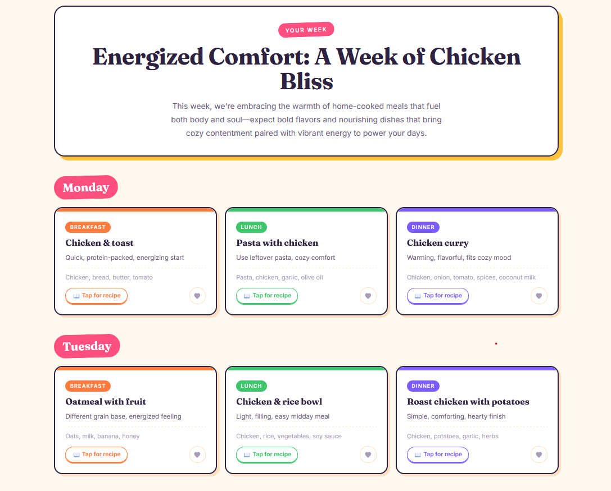

# Mealody 🍲

**Plan a week of meals around what's already in your kitchen.**

Live app: [mealody.nusrathfathima.com](https://mealody.nusrathfathima.com)
Portfolio: [nusrathfathima.com](https://nusrathfathima.com)



## The problem

Most meal-planning tools start from a recipe and hand you a shopping list of ingredients you don't have. Mealody starts from the other end: tell it what's in your kitchen, and it plans around that.

## What it does

- **A short conversation, not a form.** Four quick questions — ingredients, leftovers, vibe, cuisine — asked one at a time, chat-style.
- **A full week, generated progressively.** 21 meals (breakfast, lunch, dinner × 7 days) appear day by day rather than after one long wait, with a one-line reason for each dish.
- **Real recipes, generated on demand.** Tap any meal for ingredients scaled to your serving count, numbered steps, timing and a tip — fetched the moment you ask, then cached so repeat dishes are free.
- **Favorites & your own recipes.** Heart a dish from any week, or add your own family recipes by hand or with AI help. Picked dishes are woven into future weeks automatically — but only when their ingredients actually fit what's available that week.
- **Groceries, organized by store.** Send a recipe's ingredients to a shopping list with one tap, check items off, add notes and quantities, and share the whole list to WhatsApp or anywhere else.
- **Exports.** Download the week as a PDF (with or without full recipes) or as a shareable image.
- **Settings that persist.** Diet, servings and allergies are set once and remembered.

## Why it's built this way

This is a deliberately **fundamentals-first** project: vanilla HTML, CSS and JavaScript, no framework, no build step, no database. That's a choice, not a limitation — it's the same reasoning behind building Mealody's Android and iOS companions as native apps (Kotlin/Compose, Swift/SwiftUI) rather than with a cross-platform framework. The goal is to demonstrate that I understand what frameworks abstract away, not just how to use one.

A few decisions worth knowing about:

- **The API key never reaches the browser.** The page calls my own serverless function (`api/generate.js`), which adds the Anthropic key server-side before forwarding the request. The function also clamps the maximum response size, so the endpoint can't be abused to run up a bill even if called directly.
- **The week generates in batches**, not one giant request — faster to first content, and a failure only affects a few days instead of the whole week.
- **Recipes are lazy and cached.** Nothing is generated until a card is tapped; a background queue then fills in the rest. Every recipe is cached by dish name, so a dish you've seen before is free the next time.
- **Storage is currently client-side.** Favorites, personal recipes, grocery lists and settings live in the browser's `localStorage`. That keeps the app free to run and login-free to use, with the known tradeoff that data doesn't sync across devices — a backend is the planned next step (see below).

## Stack

| Layer | Choice |
|---|---|
| Frontend | Vanilla HTML / CSS / JavaScript — no framework |
| AI | Claude Haiku via the Anthropic API |
| Backend | One serverless function (`api/generate.js`) on Vercel |
| Hosting | Vercel, auto-deployed from this repo |
| Storage | Browser `localStorage` (no database yet) |
| Sharing | `html2canvas` for image export, Web Share API for grocery lists |

## Running it locally

There's no build step — it's a static file plus one serverless function.

```bash
git clone https://github.com/nusrathfathima/mealody.git
cd mealody
```

Open `index.html` directly in a browser to explore the UI. AI-powered features (plan generation, recipes) need the serverless function, so for those:

```bash
npm i -g vercel
vercel dev
```

Set `ANTHROPIC_API_KEY` in a `.env` file or your Vercel project settings — the key is never read from the frontend.

## Project structure

```
mealody/
├── index.html          # The entire app: markup, styles, and logic
├── api/
│   └── generate.js      # Serverless function — proxies requests to Anthropic
└── docs/                # Product spec (source of truth for the Android/iOS builds)
```

## What's next

- **A real backend** for saved recipes and grocery lists — accounts, a Postgres database, and background sync — so data follows the user across devices instead of living in one browser.
- **Native Android** (Kotlin + Jetpack Compose) and **iOS** (Swift + SwiftUI) companion apps, built from scratch using this web app as the design and feature reference.
- Smaller ideas in progress: a remembered pantry, an installable offline-capable version (PWA), and a full step-by-step "cook mode."

## About this project

Built by [Nusrath Fathima](https://nusrathfathima.com) as the flagship project in a job-search portfolio. A full write-up of the architecture, the tradeoffs, and the bugs I hit along the way lives in the case study linked from the portfolio site.
